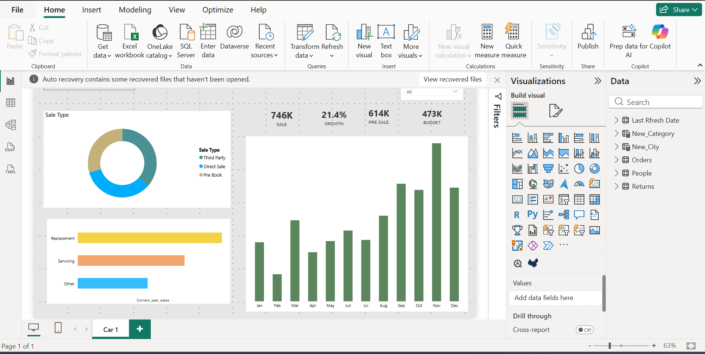

# PowerBI-carSales-Dashboard
Power BI Sales Dashboard analyzing sales trends, KPIs, and service categories using interactive visualizations.
# Power BI Sales Dashboard

This project is an interactive Power BI dashboard built to analyze sales performance, growth trends, and service categories.

## Features
- Sales by month visualization
- Sales type distribution (Direct, Third Party, Pre Book)
- KPI indicators: Total Sales, Growth %, Budget, Pre Sales
- Service category comparison (Replacement, Servicing, Other)

## Tools Used
- Microsoft Power BI
- Data Visualization
- Data Cleaning & Modeling

## Dashboard Preview

## Author
Nitu Moni

